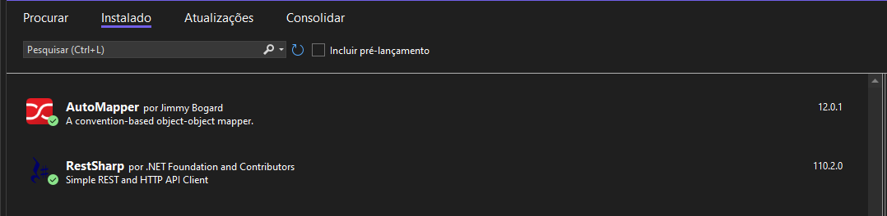
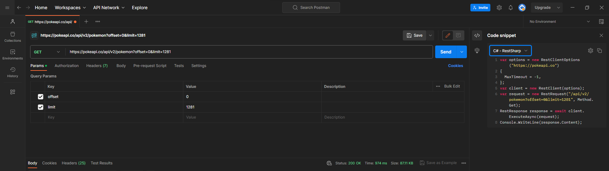
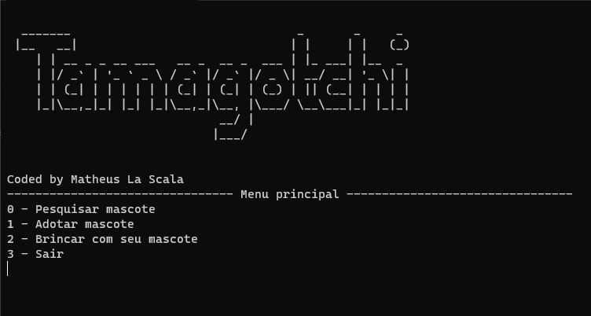

# PokéGotchi

Bem-vindo ao Projeto PokéGotchi! 

Neste arquivo README, você encontrará informações úteis sobre o funcionamento do projeto.

## Índice

- [Sobre](#sobre)
- [Tecnologias e Frameworks](#tecnologias-e-frameworks)
- [Em funcionamento](#em-funcionamento)
- [Conclusão](#conclusão)
- [Observações](#observações)

## Sobre

A inspiração para este projeto surgiu do desafio da plataforma "7 Days of Code" (https://7daysofcode.io/#back-end), onde durante uma semana, recebemos e-mails detalhando os requisitos da aplicação que devemos construir.

O principal objetivo deste projeto é aprimorar nossas habilidades em diferentes áreas, como o consumo de APIs, arquitetura de software, mapeamento de objetos e lógica de programação.

Tudo isso é apresentado de forma simplificada em um jogo interativo no estilo Tamagotchi, que utiliza a API pública de Pokémons (https://pokeapi.co) para obter informações sobre as nossas criaturas.

## Tecnologias e Frameworks 

Neste projeto, foi utilizado as seguintes tecnologias:

- C# 
- .NET 6
- RestSharp
- AutoMapper
- LINQ
- MVC

## Em funcionamento

1. Clone este repositório: `git clone https://github.com/M-LaScala/PokeGotchi`
2. Navegue até o diretório do projeto e abra o arquivo .SLN com o visual studio 2022+
3. Instale os pacote NuGet dependentes

AutoMapper a convention-based object-object mapper, a ideia principal por trás do AutoMapper é permitir que você defina uma configuração que indique como as propriedades de um objeto devem ser mapeadas para outro objeto. Uma vez que a configuração foi definida, o AutoMapper realiza o mapeamento automaticamente, copiando os valores das propriedades correspondentes do objeto de origem para o objeto de destino.

RestSharp é uma biblioteca de cliente HTTP para .NET que facilita o consumo de APIs RESTful. Com ela, você pode enviar solicitações HTTP (como GET, POST, PUT, DELETE) para serviços web, obter respostas e manipular os dados JSON ou XML retornados.

Podemos ver uma forma de gerar automaticamente o codigo para integrar o Rest Sharp ultilizando o Postman. 

JSON significa JavaScript Object Notation e é um padrão aberto para representar dados como atributos com valores.
Basicamente o JSON se baseia na notação NOME : VALOR, onde NOME pode ser o nome que você deseja usar para identificar um objeto e VALOR o valor deste objeto.

O padrão MVC: 

MVC é o acrônimo de Model (modelo), View (visão), Controller (controlador), e é um padrão de projetos de software.

Model: Modelo e acesso a dados, são essas classes que definirão os padrões dos dados e terão acesso ao "banco de dados".

View: A view corresponde ao Front-end e é onde você coloca as suas telas, como, por exemplo, o HTML em casos de aplicações web, 
janelas em casos de aplicações desktop e, no nosso caso, a sua classe de comunicação com o usuário via CMD.

Controller: Essa é a parte lógica da aplicação, essa camada é onde se aplicam as regras da aplicação e onde se relacionam os modelos e as views.

LINQ (Language Integrated Query) é uma extensão da linguagem C# que permite realizar consultas e operações em coleções de dados de forma integrada e fluente. Ele fornece uma maneira poderosa de 
consultar e manipular dados em diversas fontes, como listas, arrays, bancos de dados, serviços web e muito mais.

Ao executar a aplicação, se nenhum erro ocorrer na comunicação com a  API, você será direcionado à tela inicial. Agora sinta-se à vontade para explorar as funcionalidades disponíveis.

## Conclusão

Este projeto teve início no ano de 2023, com o propósito de ser um estudo prático para o consumo de APIs com .NET. O objetivo principal é explorar e compreender os conceitos e práticas relacionadas ao consumo de APIs, obtendo respostas e manipulando os dados JSON através da deserialização das informações e atribuindo-lhes utilidade dentro da aplicação. 

O resultado final é uma aplicação simplificada seguindo as normas da arquitetura MVC, que pode ser facilmente incrementada no futuro.

## Observações 

Site usado para gerar a mensagem do menu em forma de desenho.

http://patorjk.com/software/taag/#p=display&f=Big&t=Tamagotchi%0A

O CultureInfo foi utilizado para deixar a primeira letra em maiúsculo de um nome, seguindo as convenções da língua portuguesa.

CultureInfo.CurrentCulture.TextInfo.ToTitleCase(STRING);

https://pt.stackoverflow.com/questions/247/como-capitalizar-nomes-em-c

O publish da aplicação foi realizado seguindo a documentação oficial da Microsoft.

https://learn.microsoft.com/pt-br/dotnet/core/tutorials/publishing-with-visual-studio?pivots=dotnet-6-0
